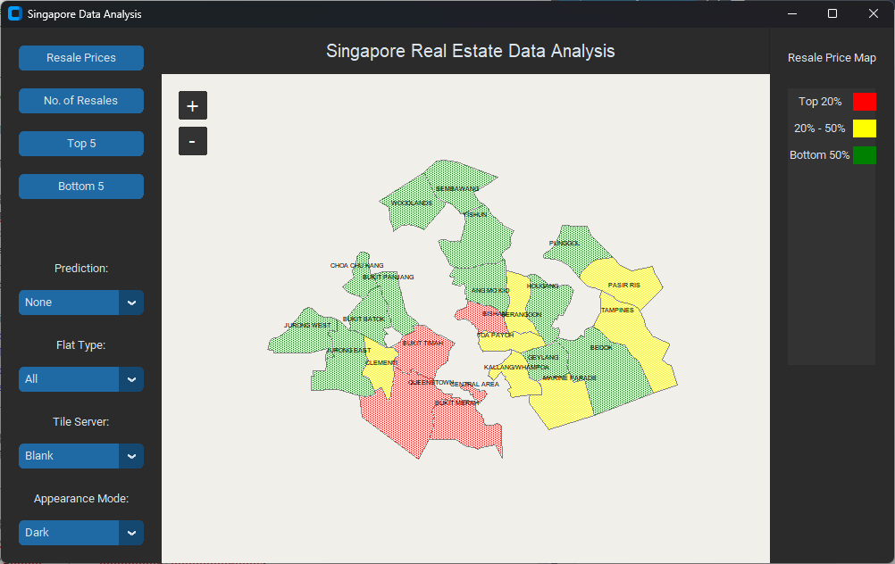
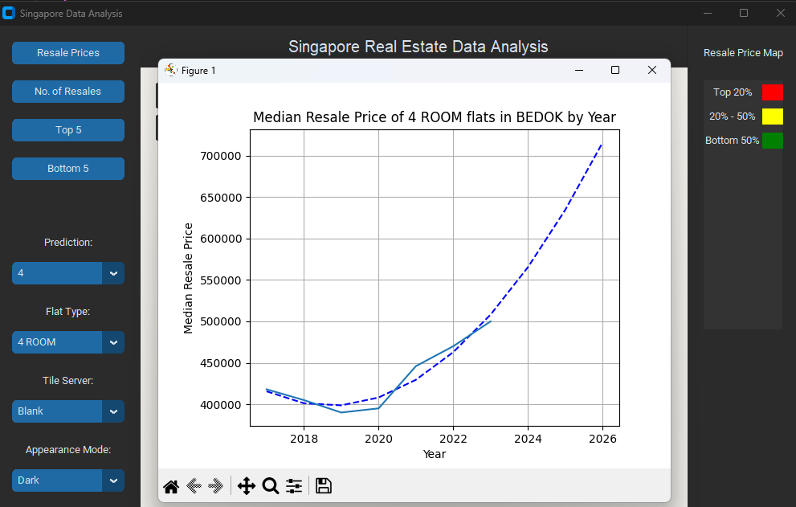

# Installation

Create a new virtual environment and activate it:

```bash
python -m venv .env
source .env/bin/activate # Linux
.env\Scripts\activate # Windows
```

Install the requirements by running the following command:

```bash
pip install -r requirements.txt
```

# Usage

All files are in place, you just need to run <code>main.py</code>.

## From scratch

If you want to setup things from scratch then follow the following steps:

1. First of all, run the `data_cleanup.py` file to clean the data. This will create a <code>data_modified.csv</code> file.

2. Run the `data.py` file to create <code>towns.json</code> file. This will extract the geo-json.

3. Run `analysis.py` to store average prices for each town and rank them. This will create a <code>average_price.json</code> file.

4. Finally, run `main.py` to run the app.

# Screenshots


<br/><br/><br/>

